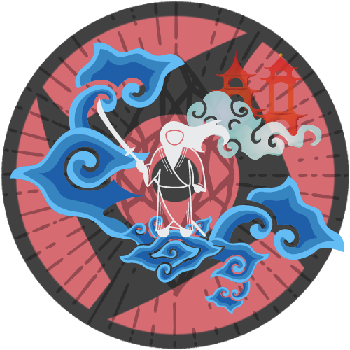

# **Izanagi-UI**

  

## Overview

- Izanagi-UI is a Design System made by [**@nicolaslima321**](https://github.com/nicolaslima321). It was initially planned to be an alternative to Material UI (MUI), with components for VueJS, since VueJS is my prefered stack, and has beeing hard (At the present time, 2022) to find much options of libraries that's supports Vue 3 (Although there's a lot of incredible ones!). But, the idea evolved, and now it also pretend to dispose components for React and React Native, to challenge myself improve in these stacks, and be a specialist as the same way I'am in VueJS.

- The inspiration for name **Izanagi** comes from the Japanese mitology, that are the god of creation (Along with her sister Izanami). It's also a reference to Naruto (My favorite anime), for the Sharingan's Genjutsu, Izanagi, that is a technique providing you the ability to manipulate the reality.

## Libraries

- ### [**@Izanagi/React**](packages/react/README.md)
  The UI-Components library for React

- ### [**@Izanagi/React**](packages/react-native/README.md)
  The UI-Components library for React Native

- ### [**@Izanagi/React**](packages/vue/README.md)
  The UI-Components library for VueJS

### How to use

- Still working on it...

### How to contribute

- Still working on it...
